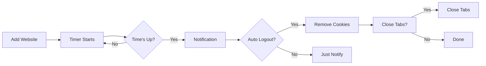

# 🔒 ZeroLock – Privacy First Session Manager

[](CHANGELOG.md)
[](LICENSE)
[](https://chrome.google.com)
[](https://developer.chrome.com/docs/extensions/mv3/)

> **Your Session, Your Control.**  
> ZeroLock is a privacy-first Google Chrome extension that helps you automatically manage website sessions. Stay logged in only when you need to.

---

## 📖 Table of Contents

- [Why ZeroLock](#-why-zerolock)
- [Features](#-features)
- [Installation](#-installation)
- [Quick Start](#-quick-start)
- [How It Works](#-how-it-works)
- [Privacy First](#-privacy-first)
- [Permissions](#-permissions)
- [FAQ](#-faq)
- [Development](#-development)
- [Security](#-security)
- [Documentation](#-documentation)
- [Contributing](#-contributing)
- [License](#-license)

---

## 🤔 Why ZeroLock?

Many internet users leave their accounts logged in for days, weeks, or even months without realizing it. While convenient, this increases security risks when:

- Your device is borrowed by someone else
- Your browser is left open on a shared computer
- Session cookies are stolen by malware
- You forget to logout on a public computer
- Accounts remain active long after you've stopped using them

ZeroLock helps you automatically manage session lifetimes, giving you control over when you stay logged in and when you logout.

## ✨ Features

### Dashboard
- **View all managed websites** in one place
- **Real-time timer status** for each site
- **Quick actions**: Logout, Pause/Resume timer, Remove

### Timer Management
- **Preset durations**: 30m, 1h, 2h, 3h, 6h, 12h, 24h
- **Custom duration**: Set any time from 1 minute to 7 days
- **Auto-logout**: Automatically logout when timer expires
- **Close tabs**: Optionally close website tabs on logout
- **Snooze**: Postpone logout for 15 minutes

### Smart Lists
- **Whitelist**: Websites that should **never** be automatically logged out (e.g., Google accounts, banking)
- **Blacklist**: Websites that should **always** be automatically logged out

### Panic Button 🔴
Emergency logout of **all** blacklisted and active managed websites with one click.

### Idle Detection 💤
Automatically log out when you're away from your computer:
- 15 minutes, 30 minutes, or 1 hour idle timeout
- Configurable in settings

### Security Center 🛡️
Transparent security status dashboard showing exactly what ZeroLock does and doesn't do:
- ✅ Extension integrity verified
- ✅ 100% local processing
- ❌ No remote data collection
- ❌ No telemetry or analytics
- ❌ No password access
- ❌ No cookie upload

### Additional Features
- **Browser Close Handler**: Logout when Chrome closes
- **Lock Screen Handler**: Logout when PC is locked
- **Dark/Light/System theme**
- **Keyboard accessible**
- **Screen reader friendly**
- **Responsive design**

## 📦 Installation

### From Chrome Web Store
*(Coming soon)*

### Manual Installation (Developer Mode)

1. **Download** the latest release from [GitHub Releases](https://github.com/tsukiforge/ZeroLock/releases)
2. **Extract** the ZIP file
3. Open Chrome and navigate to `chrome://extensions/`
4. Enable **Developer mode** (toggle in top right)
5. Click **Load unpacked**
6. Select the extracted `dist/` folder

### Build from Source

```bash
# Clone the repository
git clone https://github.com/tsukiforge/ZeroLock.git
cd zerolock

# Install dependencies
npm install

# Build the extension
npm run build

# The dist/ folder can be loaded as an unpacked extension
```

## 🚀 Quick Start

1. Click the ZeroLock icon in your browser toolbar
2. Add a website: Enter a domain (e.g., `discord.com`)
3. Choose a timer duration (e.g., 1 hour)
4. Enable Auto Logout (optional)
5. Click **Add Website**

That's it! ZeroLock will automatically:
- Track the session timer
- Notify you when time is almost up
- Logout automatically (if enabled)
- Close tabs (if enabled)

## 🔧 How It Works



## 🛡️ Privacy First

**ZeroLock works 100% offline.** All processes run locally on your device.

### ZeroLock NEVER:

| ❌ Never Does | Description |
|--------------|-------------|
| Store passwords | No password storage or access |
| Read passwords | No password field access |
| Send cookies | Cookies never leave your device |
| Send tokens | Auth tokens never transmitted |
| Collect data | No personal data collection |
| Track activity | No browsing history tracking |
| Analytics | No analytics scripts |
| Telemetry | No usage data collection |
| Fingerprinting | No browser fingerprinting |
| Cloud sync | No cloud accounts needed |
| Remote config | No remote configuration |

### ZeroLock ONLY:

| ✅ Only | Description |
|---------|-------------|
| Timer checks | Periodically checks if timers expired |
| Cookie removal | Removes cookies when you logout |
| Notifications | Alerts when sessions expire |
| Local storage | Saves your preferences locally |

## 🔐 Permissions

| Permission | Why ZeroLock Needs It |
|------------|----------------------|
| `cookies` | To remove website sessions when logging out |
| `notifications` | To alert you when session timers expire |
| `storage` | To store your configuration locally |
| `tabs` | To close tabs if you enable the option |
| `idle` | To detect when you're away from your computer |
| `alarms` | To run periodic timer checks |
| `contextMenus` | To add right-click logout option |

## ❓ FAQ

**Q: Does ZeroLock read my passwords?**  
A: **No.** ZeroLock has no access to your passwords, password fields, or login forms.

**Q: Are my cookies sent to any server?**  
A: **No.** Cookies never leave your device. ZeroLock runs entirely offline.

**Q: Is my data sold?**  
A: **No.** ZeroLock does not collect any user data.

**Q: Why does the extension need cookie permission?**  
A: To remove website session cookies when your timer expires. Cookies are only removed, never read or transmitted.

**Q: Why does the extension need notification permission?**  
A: To alert you when session timers are about to expire or have expired.

**Q: Can I use ZeroLock on shared computers?**  
A: **Yes!** ZeroLock is perfect for shared computers. Set short timers for sensitive sites.

**Q: Does ZeroLock work offline?**  
A: **Yes.** ZeroLock works completely offline with no internet connection required.

## 💻 Development

### Prerequisites

- Node.js >= 20
- npm >= 10
- Google Chrome

### Setup

```bash
git clone https://github.com/tsukiforge/ZeroLock.git
cd zerolock
npm install
npm run dev
```

### Available Scripts

| Script | Description |
|--------|-------------|
| `npm run dev` | Start development server |
| `npm run build` | Build the extension |
| `npm run lint` | Lint all source files |
| `npm run typecheck` | Check TypeScript types |
| `npm test` | Run unit tests |
| `npm run test:coverage` | Run tests with coverage |
| `npm run test:e2e` | Run E2E tests |

### Project Structure

```
src/
├── background/      # Service worker (timer, idle, panic)
├── components/      # React UI components
├── hooks/          # Custom React hooks
├── services/       # Core business logic
├── security/       # Security utilities
├── storage/        # Data layer
├── utils/          # Helper utilities
├── popup/          # Popup UI
├── options/        # Options page
├── content/        # Content scripts
└── styles/         # CSS styles
```

## 🔒 Security

See [SECURITY.md](SECURITY.md) for our security policy and [THREAT_MODEL.md](THREAT_MODEL.md) for detailed threat analysis.

### Security Features

- Strict Content Security Policy
- No eval() or Function()
- All input sanitized
- Prototype pollution prevention
- TypeScript strict mode
- 95%+ test coverage
- Regular dependency audits
- Secret scanning in CI

## 📚 Documentation

- [Architecture](ARCHITECTURE.md) - System design overview
- [Security Policy](SECURITY.md) - Security practices
- [Threat Model](THREAT_MODEL.md) - Security threat analysis
- [Contributing Guide](CONTRIBUTING.md) - How to contribute
- [Code of Conduct](CODE_OF_CONDUCT.md) - Community standards
- [Changelog](CHANGELOG.md) - Version history

## 🤝 Contributing

We welcome contributions! Please see [CONTRIBUTING.md](CONTRIBUTING.md) for details.

### Quick Contribution Flow

1. Fork the repository
2. Create a feature branch
3. Make your changes
4. Write/update tests
5. Submit a pull request

## 📄 License

This project is licensed under the MIT License - see the [LICENSE](LICENSE) file for details.

## 🙏 Acknowledgments

- Built with [React](https://react.dev/), [TypeScript](https://www.typescriptlang.org/), and [Vite](https://vitejs.dev/)
- Testing with [Vitest](https://vitest.dev/) and [Playwright](https://playwright.dev/)
- Security with [DOMPurify](https://github.com/cure53/DOMPurify)
- Icons and design inspiration from the community

---

<p align="center">
  Made with ❤️ for Privacy & Security.<br>
  ZeroLock © 2026. All rights reserved.<br>
  <strong>Your Session, Your Control.</strong>
</p>
